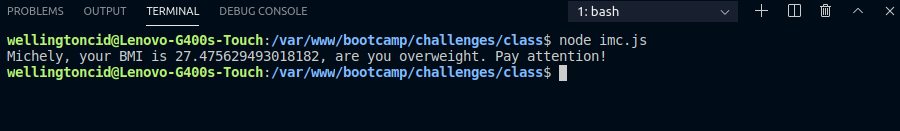
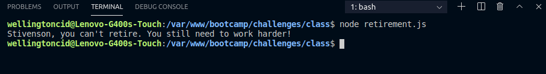

<h1 align="center">
    
</h1>

<h3 align="center">
  Challenges 1-1: First steaps with JS
</h3>

<blockquote align="center">“Completion of the challenges proposed in the Bootcamp LaunchBase”</blockquote>

<p align="center">

  <a href="https://linkedin.com/in/wellingtoncid">
    
  </a>

  <a href="LICENSE" >
    
  </a>

</p>

<p align="center">
  <a href="#rocket-about-the-challenge">Challenges</a>&nbsp;&nbsp;&nbsp;|&nbsp;&nbsp;&nbsp;
  <a href="#memo-license">License</a>
</p>

## :rocket: About the Challenge

Challenges to strengthen some concepts, among them:

- **Variables**;
- **Conditionals**;
- **Operators**.

### BMI Calcultation

Create a program to calculate a person's BMI and obesity level.

```js
// BMI calculation

const name = 'Michely'
const weight = 73
const height = 1.63

const bmi = weight / (height * height)

let message = ""

if (bmi > 25) {
    message = `${name}, your BMI is ${bmi}, are you overweight. Pay attention!`
} else {
    message = `${name}, your BMI is ${bmi}, your weight is controlled. Very good!`
}

console.log(message)
```

<p>
  </img>
</p>


### Retirement Calculation

Create a program to calculate a person's retirement.
<p>Obs .: This calculation is fictitious, within retirement there are many other factors to be taken into account:)</p>

```js
// Retirement Calculation

const name = "Stivenson";
const gender = "M";
const age = 53;
const contribution = 27;

const calculateContribution = age + contribution

const menCanRetire = age == 'M' && contribution >= 35 && calculateContribution >= 95
const womenCanRetire = age == 'F' && contribution >= 30 && calculateContribution >= 85

if (menCanRetire || womenCanRetire) {
    console.log(`${name}, you can retire!`)
} else {
    console.log(`${name}, you can't retire. You still need to work harder!`)
}
```

<p>
  </img>
</p>

## :memo: License

This project is under the MIT license. See the archive [LICENSE](/LICENSE) for more details.

---

Made by [Wellington Cid](https://linkedin.com/in/wellingtoncid) with [Rocketseat](https://rocketseat.com.br) support
