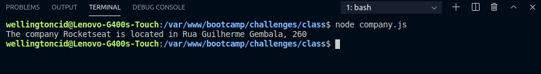

<h1 align="center">
    
</h1>

<h3 align="center">
  Challenges 1-2: Dealing with objects and vectors
</h3>

<blockquote align="center">“Completion of the challenges proposed in the Bootcamp LaunchBase”</blockquote>

<p align="center">

  <a href="https://linkedin.com/in/wellingtoncid">
    
  </a>

  <a href="LICENSE" >
    
  </a>

</p>

<p align="center">
  <a href="#rocket-about-the-challenge">Challenges</a>&nbsp;&nbsp;&nbsp;|&nbsp;&nbsp;&nbsp;
  <a href="#memo-license">License</a>
</p>

## :rocket: About the Challenge

Challenges to strengthen some concepts, among them:

- **Objects**;
- **Vectors**.

### Construction and printing objects

Create a program that stores Rocketseat company data inside an object called `company`.

```js
// Contruction and print objetcs

const user = {
    name: 'Diego',
    company: {
        name: 'Rocketseat',
        color: 'Purple',
        focus: 'Programming',
        address: {
            publicplace: 'Rua Guilherme Gembala',
            number: 260
        }
    }
}

console.log(`The company ${user.company.name} is located in ${user.company.address.publicplace}, ${user.company.address.number}`)
```

<p>
  </img>
</p>

### Vectors and Objects

Create a program with an object to store data from a programmer such as `name`,`age` and `technologies` that work.

```js
// vector and objects

const programmer = {
    name: 'Carlos',
    age: 32,
    technologies: [
        { name: "C++", speciality: "Desktop" },
        { name: 'Python', speciality: 'Data Science' },
        { name: "JavaScript", speciality: "Web/Mobile" }
    ]
}

console.log(`The user ${programmer.name} is ${programmer.age} years old and uses technology ${programmer.technologies[0].name} with speciality in ${programmer.technologies[0].speciality}`)
```

<p>
  </img>
</p>

## :memo: License

This project is under the MIT license. See the archive [LICENSE](/LICENSE) for more details.

---

Made by [Wellington Cid](https://linkedin.com/in/wellingtoncid) with [Rocketseat](https://rocketseat.com.br) support
