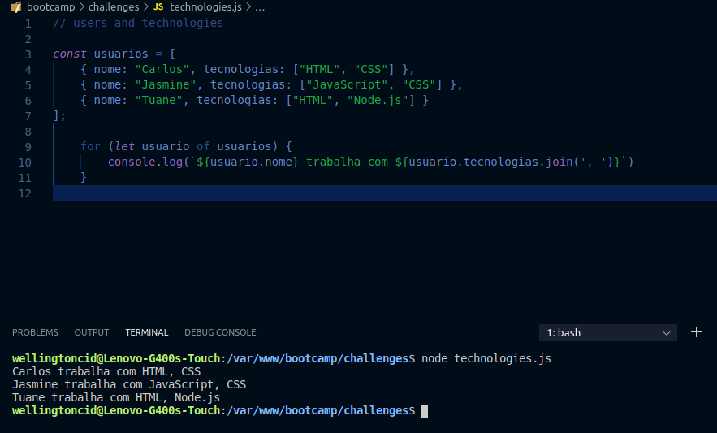
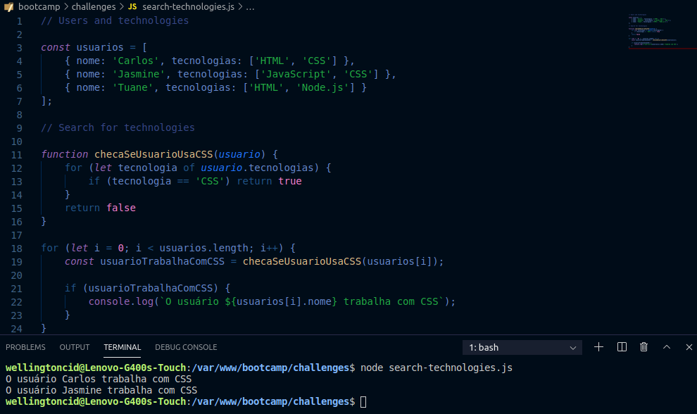
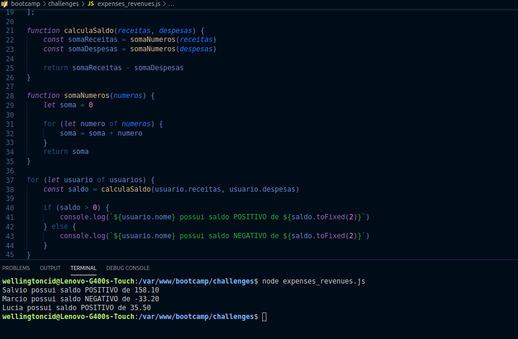

<h1 align="center">
    
</h1>

<h3 align="center">
  Challenges 1-3: Functions and repetition structures
</h3>

<blockquote align="center">“Completion of the challenges proposed in the Bootcamp LaunchBase”</blockquote>

  

  

  <a href="#rocket-about-the-challenge">Challenges</a>&nbsp;&nbsp;&nbsp;|&nbsp;&nbsp;&nbsp;
  <a href="#memo-license">License</a>

## :rocket: About the Challenge

Challenges to strengthen some concepts, among them:

- **Functions and methods**;
- **Repetition structures**;
- **Scopes**.

### Users and technologies

Create a program that stores an array of users (objects), each user has a `nome` and their `tecnologias`

  </img>

### Search for technologies

Based on the previous challenge, use the same user list built.

Create a function that receives data from a user object and returns IF the user works with CSS or not. This function must return a boolean `true / false`.

  </img>

### Sum of expenses and revenues

Create a program that calculates the sum of revenues and expenses of users and at the end returns the balance (`revenues - expenses`).

  </img>

## :memo: License

This project is under the MIT license. See the archive [LICENSE](/LICENSE) for more details.

---

Made by [Wellington Cid](https://linkedin.com/in/wellingtoncid) with [Rocketseat](https://rocketseat.com.br) support
