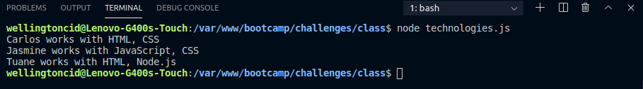
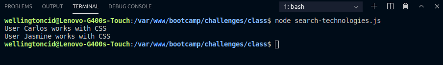
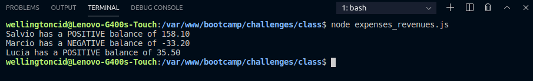

<h1 align="center">
    
</h1>

<h3 align="center">
  Challenges 1-3: Functions and repetition structures
</h3>

<blockquote align="center">“Completion of the challenges proposed in the Bootcamp LaunchBase”</blockquote>

<p align="center">

  <a href="https://linkedin.com/in/wellingtoncid">
    
  </a>

  <a href="LICENSE" >
    
  </a>

</p>

<p align="center">
  <a href="#rocket-about-the-challenge">Challenges</a>&nbsp;&nbsp;&nbsp;|&nbsp;&nbsp;&nbsp;
  <a href="#memo-license">License</a>
</p>

## :rocket: About the Challenge

Challenges to strengthen some concepts, among them:

- **Functions and methods**;
- **Repetition structures**;
- **Scopes**.

### Users and technologies

Create a program that stores an array of users (objects), each user has a `name` and their `technologies`

```js
// Users and technologies

const users = [
    { name: 'Carlos', technologies: ['HTML', 'CSS'] },
    { name: 'Jasmine', technologies: ['JavaScript', 'CSS'] },
    { name: 'Tuane', technologies: ['HTML', 'Node.js'] }
];

for (let user of users) {
    console.log(`${user.name} works with ${user.technologies.join(', ')}`)
}
```

<p>
  </img>
</p>


### Search for technologies

Based on the previous challenge, use the same user list built.

Create a function that receives data from a user object and returns IF the user works with CSS or not. This function must return a boolean `true / false`.

```js
// Users and technologies

const users = [
    { name: 'Carlos', technologies: ['HTML', 'CSS'] },
    { name: 'Jasmine', technologies: ['JavaScript', 'CSS'] },
    { name: 'Tuane', technologies: ['HTML', 'Node.js'] }
];

// Search for technologies

function checkIfUserUseCSS(user) {
    for (let technology of user.technologies) {
        if (technology == 'CSS') return true
    }
    return false
}

for (let i = 0; i < users.length; i++) {
    const userWorksWithCSS = checkIfUserUseCSS(users[i]);

    if (userWorksWithCSS) {
        console.log(`User ${users[i].name} works with CSS`);
    }
}
```

<p>
  </img>
</p>

### Sum of expenses and revenues

Create a program that calculates the sum of revenues and expenses of users and at the end returns the balance (`revenues - expenses`).

```js
// Expenses and revenues

const users = [
    {
        name: 'Salvio',
        revenues: [115.3, 48.7, 98.3, 14.5],
        expenses: [85.3, 13.5, 19.9]
    },
    {
        name: 'Marcio',
        revenues: [24.6, 214.3, 45.3],
        expenses: [185.3, 12.1, 120.0]
    },
    {
        name: 'Lucia',
        revenues: [9.8, 120.3, 340.2, 45.3],
        expenses: [450.2, 29.9]
    }
];

function calculateBalance(revenues, expenses) {
    const sumRevenues = sumNumbers(revenues)
    const sumExpenses = sumNumbers(expenses)

    return sumRevenues - sumExpenses
}

function sumNumbers(numbers) {
    let sum = 0

    for (let number of numbers) {
        sum = sum + number
    }
    return sum
}

for (let user of users) {
    const balance = calculateBalance(user.revenues, user.expenses)

    if (balance > 0) {
        console.log(`${user.name} has a POSITIVE balance of ${balance.toFixed(2)}`)
    } else {
        console.log(`${user.name} has a NEGATIVE balance of ${balance.toFixed(2)}`)
    }
}
```

<p>
  </img>
</p>

## :memo: License

This project is under the MIT license. See the archive [LICENSE](/LICENSE) for more details.

---

Made by [Wellington Cid](https://linkedin.com/in/wellingtoncid) with [Rocketseat](https://rocketseat.com.br) support
