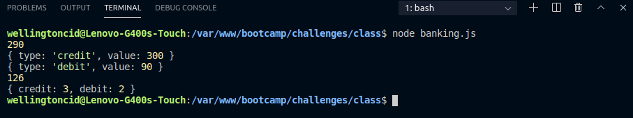

<h1 align="center">
    
</h1>

<h3 align="center">
  Challenges 1-4: Application: Banking operations
</h3>

<blockquote align="center">“Completion of the challenges proposed in the Bootcamp LaunchBase”</blockquote>

  

  

  <a href="#rocket-about-the-challenge">Challenges</a>&nbsp;&nbsp;&nbsp;|&nbsp;&nbsp;&nbsp;
  <a href="#memo-license">License</a>

## :rocket: About the Challenge

Challenges to strengthen some concepts, among them:

- **Booleans**;
- **Organization**;
- **Standardization**;
- **Writing**;

### Project Banking Operations

Create a program to perform banking transactions on a user's account.

  </img>

## :memo: License

This project is under the MIT license. See the archive [LICENSE](/LICENSE) for more details.

---

Made by [Wellington Cid](https://linkedin.com/in/wellingtoncid) with [Rocketseat](https://rocketseat.com.br) support
